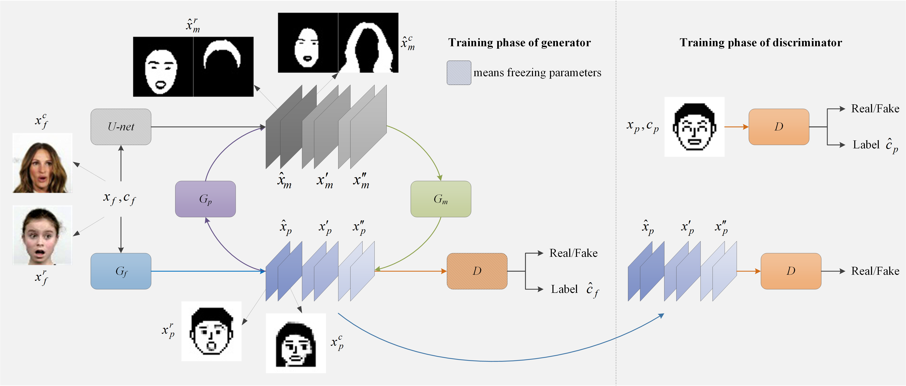

# Semantic translation of face image with limited pixels for simulated prosthetic vision
Facial perception and cognition are among the most critical functions of retinal prostheses for blind people. However, owing to the limitations of the electrode array, simulated prosthetic vision can only provide limited pixel images, which seriously weakens the image semantics expression. To improve the intelligibility of face images with limited pixels, we constructed a face semantic information transformation model to transform real faces into pixel faces based on the analogy between human and artificial intelligence, named F2Pnet (face to pixel networks). This is the first attempt at face pixelation using deep neural networks for prosthetic vision. Furthermore, we established a pixel face database designed for prosthesis vision and proposed a new training strategy for generative adversarial networks for image-to-image translation tasks aiming to solve the problem of semantic loss under limited pixels. The results of psychophysical experiments and user studies show that the identifiability of pixel faces in characteristic and expression is much better than that of comparable methods, which is significant for improving the social ability of blind people.

Paper URL is https://authors.elsevier.com/a/1fTzl4ZQE82yG

## Requirements

- [Windows or Linux]
- [Tensorflow (2.5)]
- [tensorflow-addons]
- [OpenCV]

## Training strategy

The core idea of the training strategy is to transform the spatial semantic into more easy to learn masks and the spectral semantic into more easy to learn labels.

## Dataset Preparation

    ├── main.py
    ├── checkpoint (Pretrained F2Pnet)
    ├── unet.h5 (Pretrained U-net)
    ├── AIRS-PFD (Our pixel face database) 
    	├── Pixel
			├── xxxxxx.png
			├── xxxxxx.png
			└── ...
		├── label.txt
    ├── CelebA
		├── celeba
			├── 000001.jpg 
			├── 000002.jpg
			└── ...
    	├── Anno
		    ├── list_attr_celeba_front.txt (We have provided) 
    ├── RafD-front (Please download RafD yourself for licensing reasons)
		├── xxxxxx.jpg 
		├── xxxxxx.jpg
		└── ...
    ├── test (The test image that you wanted)
        ├── a.jpg 
        ├── b.png
        └── ...

## Train

	python main.py --phase train

## Test

	## CelebA

	python main.py --phase test

	## test images

	python main.py --phase test --test_path ./test

## Pretrained model

- Download pretrained F2Pnet, pretrained U-net, and list_attr_celeba_front.txt here (https://pan.baidu.com/s/1i1LXF8ZrZRCtL2izEMelCQ) (uv6n)
